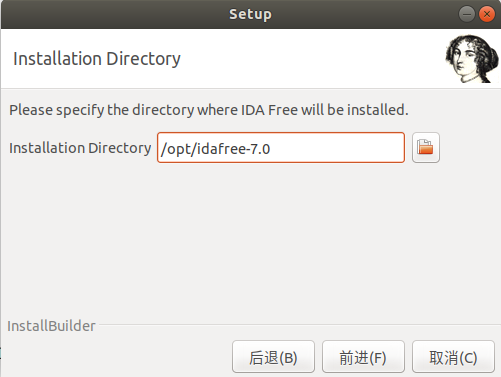

# IDA

## What's IDA?

IDA(Interactive Disassembler Professional) is a disassembler for computer software which generates assembly language source code from machine-executable code. It supports a variety of  executable formats for different processors and operating systems. It also can be used as a debugger for Windows PE, Mac OS X Mach-O and Linux ELF executables. A decompiler plug-in for programs compiled with a C/C++ compiler is available at extra cost. The latest full version of IDA Pro is commercial; while an earlier and less capable version is available for download free of charge. (version 7.0 as of February 2018)

IDA performs automatic code analysis, using cross-references between code sections, knowledge of parameters of API calls, and other information. However, the nature of disassembly precludes total accuracy, and a great deal of human intervention is necessarily required; IDA has interactive functionality to aid in improving the disassembly. A typical IDA user will begin with an automatically generated disassembly listing and then convert sections from code to data and vice versa, rename, annotate, and otherwise add information to the listing, until it becomes clear what it does.

## How to Install IDA7.0?

### Usage

#### Windows

All you need is to download the [idafree70_windows.exe](https://github.com/AngelKitty/IDA7.0/blob/master/idafree70_windows.exe) , double-click it and complete the installation.

#### Linux

IDA is still, as of this writing (November 7th, 2018), a 32-bit application and both IDA & its installer(*) require certain 32-bit libraries to be present on your Linux system before they can run.

Here is the list of commands you need to run in order to install those dependencies, for the following systems:

- Debian & derivative systems such as Ubuntu, Xubuntu, …
- Red Hat Enterprise Linux 7.2 (and likely other versions as well)

> Note: we cannot possibly install & try IDA on all flavors/versions of all Linux distributions, but we will do our best to keep updating this post with relevant information, if we realize there is a distribution requiring special instructions.

**(*) that is: if you want the installer to run a graphical interface, instead of a command-line one.**

##### Debian && Ubuntu(10.0-18.04)

**Common dependencies**

The following should allow IDA to run on most Linux systems deriving from Debian distributions:

```shell
sudo dpkg --add-architecture i386
sudo apt-get update
sudo apt-get install libc6-i686:i386 libexpat1:i386 libffi6:i386 libfontconfig1:i386 libfreetype6:i386 libgcc1:i386 libglib2.0-0:i386 libice6:i386 libpcre3:i386 libpng12-0:i386 libsm6:i386 libstdc++6:i386 libuuid1:i386 libx11-6:i386 libxau6:i386 libxcb1:i386 libxdmcp6:i386 libxext6:i386 libxrender1:i386 zlib1g:i386 libx11-xcb1:i386 libdbus-1-3:i386 libxi6:i386 libsm6:i386 libcurl3:i386 
```

##### Xubuntu 15.10 

It is also necessary to run those commands, get a usable GUI for IDA on Xubuntu 15.10:

```shell
sudo apt-get install libgtk2.0-0:i386 gtk2-engines-murrine:i386 gtk2-engines-pixbuf:i386 
```

##### Red Hat Enterprise Linux 7.2

IDA will require the following packages to work properly on RHEL 7.2 (and probably any other RPM-based distribution) :

```shell
redhat-lsb-core.i686
glib2.i686
libXext.i686
libXi.i686
libSM.i686
libICE.i686
freetype.i686
fontconfig.i686
dbus-libs.i686 
```

**Install IDA7.0**

On Ubuntu18.04 for example. You can download the [idafree70_linux.run](https://github.com/AngelKitty/IDA7.0/blob/master/idafree70_linux.run) to your localhost, and use the following commands to install IDA.

```shell
git clone https://github.com/AngelKitty/IDA7.0.git
cd IDA7.0/
chmod +x idafree70_linux.run
./idafree70_linux.run
```

If you haven't installed git before, you can run following command to get git.

```shell
sudo apt-get install git
```

When you see the following interface, it means you success.


Then you have to click “next” to complete the installation. When you meet the Installation Directory solution, It is suggested to change the default path, and then select the directory `/opt/...` where IDA will be installed, like this:



Then create a symbolic link to the `/usr/bin` folder.

```shell
sudo ln -s /opt/idafree-7.0/ida64 /usr/bin
```

Then you can test ida64 command and it should work.


Maybe you meet the problem like "Package 'libstdc++.so.5' has no installation candidate", you can run the following command to solve.

```shell
sudo apt-get install libstdc++5:i386
```

Then you can start your ida trip.

 

Desktop entries(.desktop file) are the configuration files that describe how an application is launched and which type of data it can handle. They also configure how an application appears in a menu with an icon. If you want to create a .desktop file, you can create a ida.desktop and write the following lines to it:

```shell
[Desktop Entry]
Version=7.0
Name=Ida64
Exec=/usr/bin/ida64
Icon=/opt/idafree-7.0/appico64.png
Terminal=false
Type=Application
Categories=Application;Development;Utility;
Comment=Ida Pro 64bit
```

Save this file as "ida.desktop" at ~/.local/share/applications/ida.desktop

#### Mac

Download the [idafree70_mac.tgz](https://github.com/AngelKitty/IDA7.0/blob/master/idafree70_mac.tgz) and decompress, and then you can just double-click the .app file to install IDA or run the following commands to complete installation.

```shell
cd idafree-7.0-osx-installer.app/Contents/MacOS/
chmod +x installbuilder.sh
./installbuilder.sh
```

Other steps or configurations are the same as Linux.

### Videos

```shell
https://www.youtube.com/watch?v=3FnyzJ6bTEs
```

### Link

```shell
https://www.hex-rays.com/products/ida/support/download_freeware.shtml
```

### Contributions

Thanks to Daniel Sc4 for upload the videos.